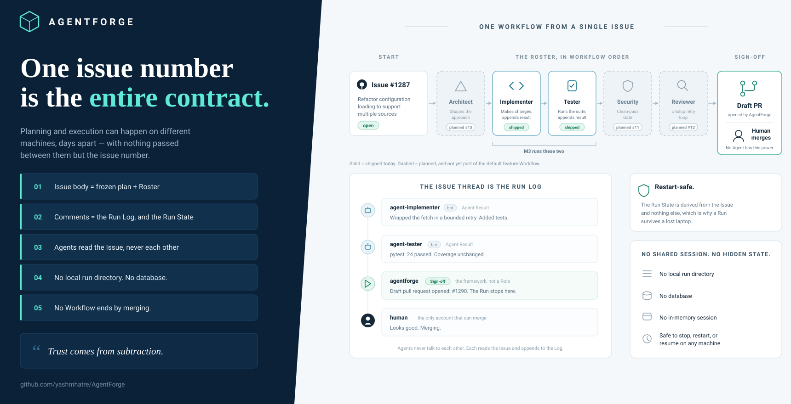

# AgentForge

AgentForge is a standalone Python framework for coordinating specialized software agents through reusable workflows.

A human states a Task. The Orchestrator files a GitHub issue carrying a frozen plan and the Roster of Roles that will execute it. `agentforge implement <n>` runs the Issue's Workflow and opens a draft pull request for a human to sign off. No workflow ever merges.



## Status

The M3 runtime now runs multiple Roles in Workflow order. The default `feature`
Workflow invokes the Implementer, the Tester, Security, and then the Reviewer,
posting each Agent Result to the Issue before starting the next Step.

```console
$ agentforge plan "add a retry to the loader"

The Orchestrator has questions before it writes anything down.
Answer them, or press Enter on an empty line to plan with what it has.

  Which loader — the orders one, or the returns feed?
  > orders

  Retry on 5xx only, or timeouts too?
  > both, cap it at three attempts

Filed issue #12: https://github.com/acme/pipelines/issues/12
  Roster: implementer (standard)
  Interview: 2 question(s) answered

Run it with:  agentforge implement 12

$ agentforge implement 12 --allow-commands
  [ok] implementer (standard) — Wrapped the fetch in a bounded retry.
  [ok] tester (standard) — pytest: 24 passed.
  [ok] security (deep) — Audited the change; no findings.
  [ok] reviewer (cheap) — The change matches the plan. unslop: clean on attempt 2.

Draft pull request: https://github.com/acme/pipelines/pull/13
AgentForge stops at Sign-off. A human merges.
```

The two commands can run on different machines. Nothing is shared between them but the issue number.

The interview happens while you are still at the keyboard, because ADR-0003
freezes the plan the moment it is filed. It is rounds of one-shot invocations
rather than a conversation — the Provider port has no session — and it ends as
soon as the Orchestrator has enough, or as soon as you press Enter on an empty
line. With nothing interactive attached, there is no interview at all: a
scheduled Run has nobody to ask, and blocking on an answer that will never
arrive is worse than planning from what was typed.

A term you settle in the interview is recorded in the project's own `CONTEXT.md`
so the same question is not asked next week. That leaves changes in your working
tree; `agentforge plan` says which files, and they are yours to review and
commit.

Without `--allow-commands`, the Implementer remains default-deny and the Tester
reports that it could not run the suite; it never substitutes reading tests and
claims completion. Security, the Reviewer, and the Architect need no such flag —
auditing, reviewing, and designing are reading. All six Roles `CONTEXT.md` names
now run. Still to come: context packs; plugins; and `agentforge init`. See
[`docs/PLAN.md`](docs/PLAN.md).

The Reviewer writes the prose a human reads at Sign-off, and that prose is
scanned by the vendored `unslop` scanners before it is posted. A finding sends
the Reviewer its own findings to rewrite against, twice at most. The scan is a
Command and not a Gate: prose that still scans dirty on the third attempt is
posted anyway with the report attached, because holding a finished Run on a
cosmetic check trades a real cost for a stylistic one. The report reaches the
Run Log either way.

## Requirements

- Python 3.11 or newer
- `git`, and a repository with a GitHub remote
- The [GitHub CLI](https://cli.github.com), authenticated
- A coding-agent CLI. `claude` ships supported; `codex` exists to keep the provider port honest.

AgentForge never touches a model API and handles no credentials of its own. Whatever your coding-agent CLI is already authenticated with is what a Run costs.

## Commands

| Command | What it does |
| --- | --- |
| `agentforge plan "<task>"` | Runs the Orchestrator at the `deep` tier and files an issue carrying the plan and roster. |
| `agentforge implement <n>` | Reads Issue `<n>`, runs its Workflow on a branch, posts each Agent Result, and opens a draft PR. Add `--allow-commands` when the Workflow must execute a suite. |
| `agentforge unslop <file>` | Scans prose for machine-writing tells. Deterministic; no model involved. |

Both agent commands take `--provider` and `--tier`. A bare `--tier deep` moves every Role; `--tier implementer=deep` moves one.

## Workflows

Three ship, and the Issue's plan block names which one a Run executes. A project
adds its own by dropping a definition beside them.

| Workflow | Steps | For |
| --- | --- | --- |
| `feature` | implementer, tester, security, reviewer | The default: build something that was not there before. |
| `bugfix` | implementer, tester, reviewer | A fix, verified and reported on. A bug that touches auth is a Task for `feature`. |
| `review` | security, reviewer | A diff AgentForge did not write. Point it at a branch somebody else wrote. |

`review` is the only one with no Implementer. It ends at a draft pull request
like the others, because the branch already carries the commits it was pointed
at.

The Architect is in none of them. It runs `deep`, most Tasks do not need a
design pass, and one on every Run would be the most expensive default in the
project — so the Orchestrator selects it for design-heavy Tasks, and a project
that always wants one names it in a Workflow of its own. Its design reaches the
Run Log rather than the next Role's prompt, which is a limit of what a Context
Pack carries today.

A step may declare a Gate that must clear before the next one starts. None of
the shipped definitions do: a Gate suspends the Run until it clears, and a
default Workflow that stops to wait on somebody is a choice a project makes
rather than one it inherits.

## Project configuration

AgentForge reads `.agentforge/config.yaml` from the target repository when it
exists. M3 is read-only: it never creates the directory or writes the file.
Without a file, the documented Provider capability defaults are Claude
`native` and every other Provider `fragment`.

```yaml
providers:
  claude:
    capability_tier: native
  codex:
    capability_tier: fragment

gates:
  tests:
    suite: pytest
```

A Role declares the Vendored Skills it needs. A native Provider receives them
through its CLI's skill mechanism; a fragment Provider receives the same
`SKILL.md` text appended to the prompt. Capability Tiers are configuration,
never the result of probing an installed CLI.

A Workflow step declaring `gate: tests` runs `gates.tests.suite` and holds the
Run when it fails, posting the output to the Issue. The default is `pytest`. A
string is split the way a shell would split it; a list is taken as written,
which is how a path with a space in it gets named. The Gate runs the suite
itself rather than believing what the Tester said about it, and it needs no
`--allow-commands`: ADR-0007 governs what a Role may run, and this is the
project's own declared suite rather than a command a model chose.

A suite that ran and failed suspends the Run — the commit that fixes it clears
the Gate. A suite that could not be run at all halts the Run, because there is
nothing there for a later Run to clear.

`gate: security` needs no configuration. It reads the Security Agent's Findings
out of the Run Log: none of them clears it, and any of them suspends the Run and
marks the Security Step to run again, so the audit that resumes reads the fixed
code rather than the verdict about the old code.

## Project layout

- `core/` — the contracts, the command runner, the GitHub boundary, the plan format, and the run loop.
- `agents/` — the Role definitions and their prompts.
- `providers/` — one adapter per coding-agent CLI.
- `workflows/` — the three shipped Workflow definitions; `context/` and `plugins/` are later milestones.
- `skills/` — vendored third-party skills. Never edited in place; see `skills/MANIFEST.yaml`.

Read [`CONTEXT.md`](CONTEXT.md) before writing anything, and [`docs/adr/`](docs/adr/) for the decisions that constrain it.

## Tests

```console
$ pip install -e ".[dev]"
$ pytest
```

The suite runs offline: no network, no GitHub account, and no coding-agent CLI installed. One fake command runner stands in for every external process.
